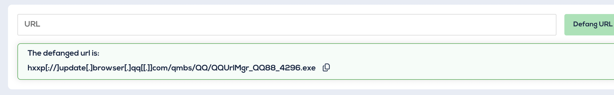

# Scenario

It's a Friday evening at PandaProbe Intelligence when a notification appears on your CTI platform. While most are already looking forward to the weekend, you realise you must pull overtime because SwiftSpend Finance has opened a new ticket, raising concerns about potential malware threats. The finance company, known for its meticulous security measures, stumbled upon something suspicious and wanted immediate expert analysis.

As the only remaining CTI Analyst on shift at PandaProbe Intelligence, you quickly took charge of the situation, realising the gravity of a potential breach at a financial institution. The ticket contained multiple file attachments, presumed to be malware samples.

Connecting to the machine

Start the virtual machine in split-screen view by clicking the green Start Machine button on the upper right section of this task. If the VM is not visible, use the blue Show Split View button at the top-right of the page. Additionally, you can open the DocIntel platform using the credentials below.

### Task-1 : Who shared the malware samples?

 Ans: Oliver Bennett

 Screeshot: 

 

### Task-2: What is the SHA1 hash of the file "pRsm.dll" inside samples.zip?

Ans: 9d1ecbbe8637fed0d89fca1af35ea821277ad2e8

Screenshot: 

Downloaded the attachment

Extracted the downloaded documents.

Get the SHA1 using sha1sum

### 3: Which malware framework utilizes these DLLs as add-on modules?

Ans: MgBot

Screenshot:

I did some google search regarding "pRsm.dll" and found out 

### 4: Which MITRE ATT&CK Technique is linked to using pRsm.dll in this malware framework?

Ans: T1123

Screenshot :

### 5: What is the CyberChef defanged URL of the malicious download location first seen on 2020-11-02?

Ans: hxxp[://]update[.]browser[.]qq[.]com/qmbs/QQ/QQUrlMgr_QQ88_4296[.]exe

Screenshot:

Defang the URL

### 6: What is the CyberChef defanged IP address of the C&C server first detected on 2020-09-14 using these modules?

Ans: 122[.]10[.]90[.]12

Screenshot: 

### 7: What is the SHA1 hash of the spyagent family spyware hosted on the same IP targeting Android devices on November 16, 2022?

Ans: 1c1fe906e822012f6235fcc53f601d006d15d7be

Screenshot: 

Search the ip address in virus total

